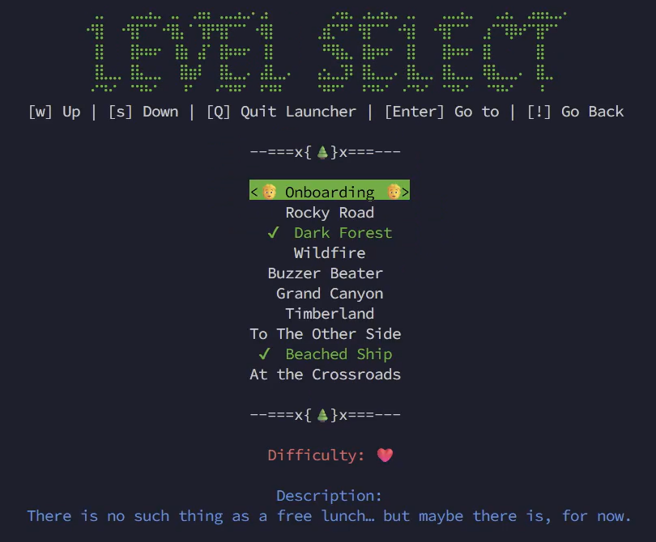
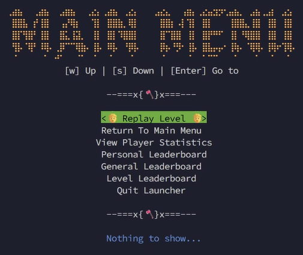
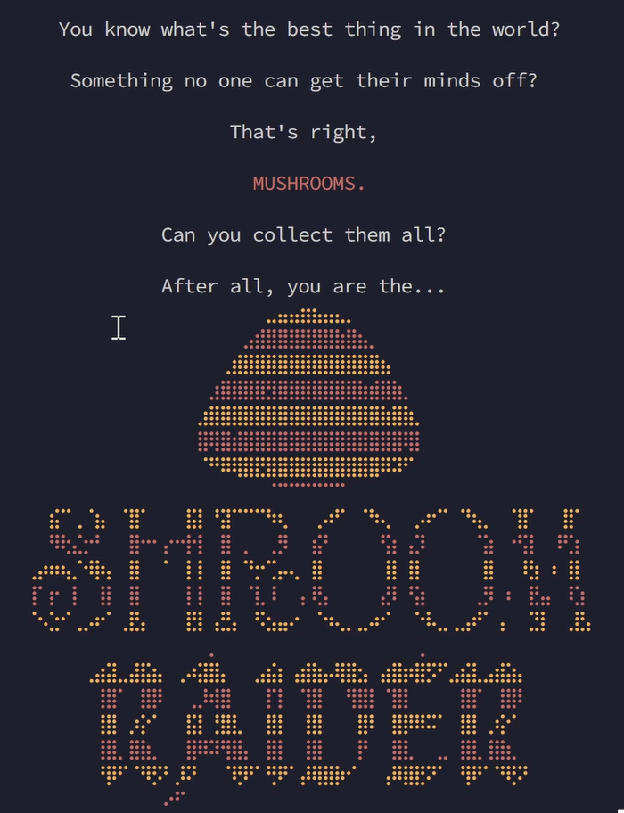
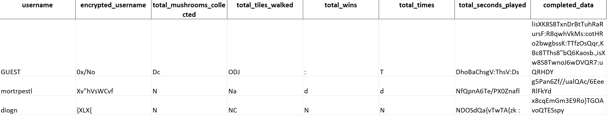
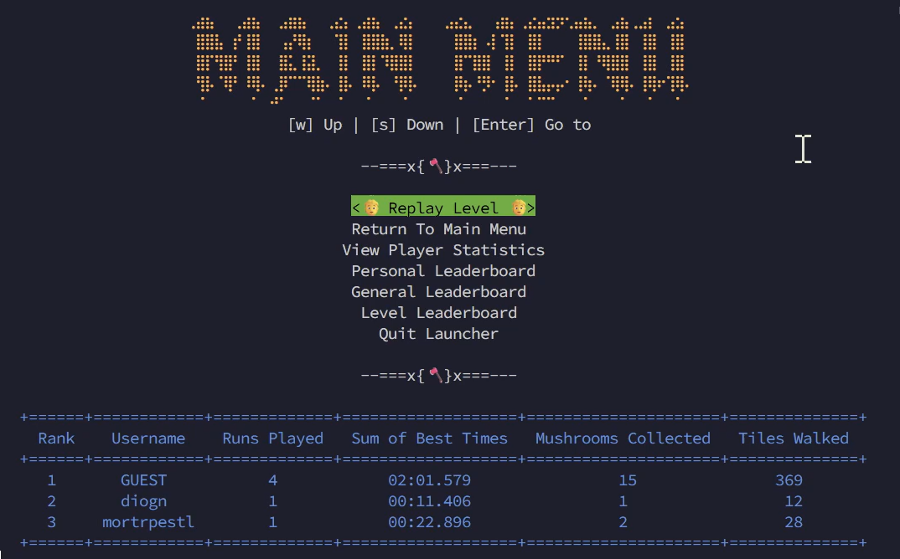
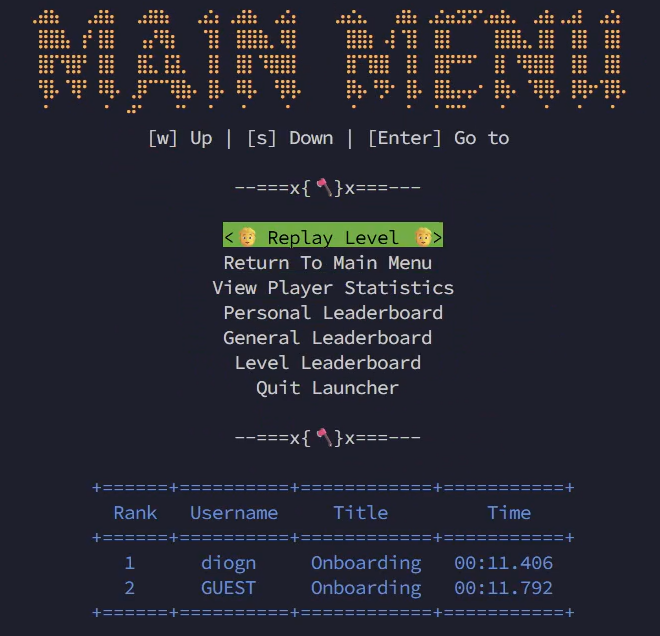
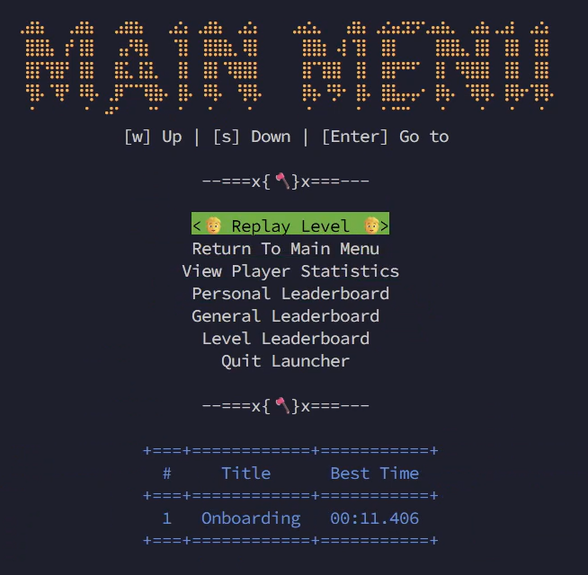
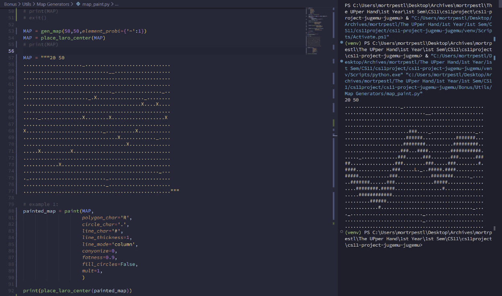
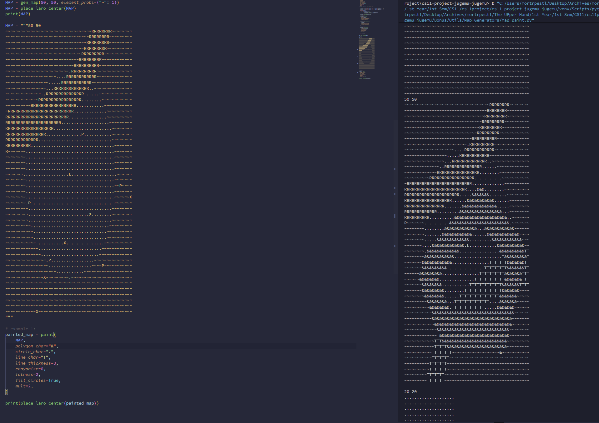
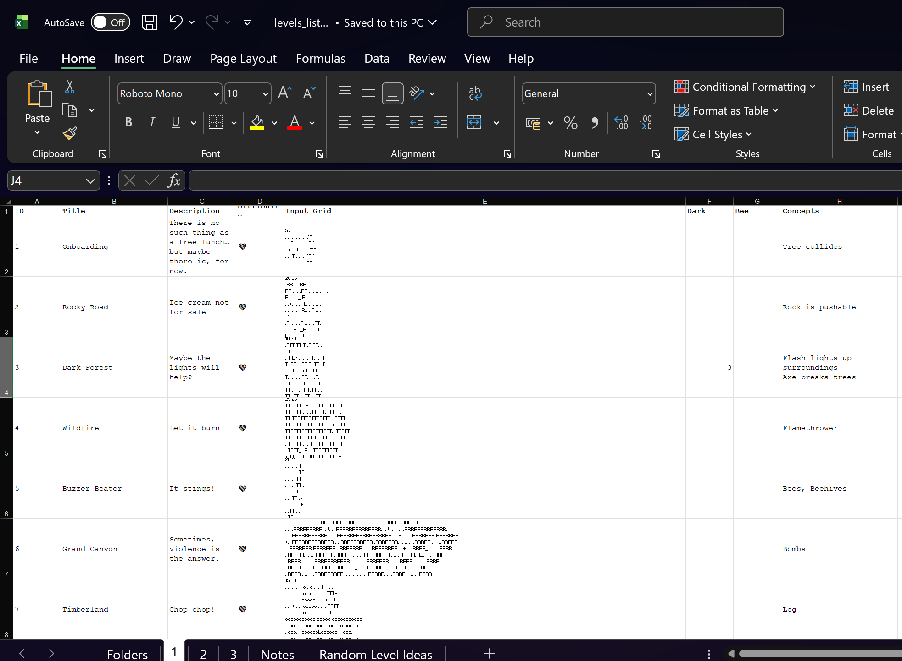

# **DLC**

```
⠀⠀⠀⠀⠀⠀⠀⠀⠀⠀⠀⠀⠀⠀⠀⠀⠀⠀⠀⠀⠀⣀⣤⣤⣶⣦⣤⣄⡀⠀⠀⠀⠀⠀⠀⠀⠀⠀⠀⠀⠀⠀⠀⠀⠀⠀⠀⠀⠀⠀
⠀⠀⠀⠀⠀⠀⠀⠀⠀⠀⠀⠀⠀⠀⠀⠀⠀⠀⠀⣠⣾⣿⣿⣿⣿⣿⣿⣷⣿⣦⡀⠀⠀⠀⠀⠀⠀⠀⠀⠀⠀⠀⠀⠀⠀⠀⠀⠀⠀⠀
⠀⠀⠀⠀⠀⠀⠀⠀⠀⠀⠀⠀⠀⠀⠀⠀⠀⢀⣾⣿⣿⣿⣿⣿⣿⣿⣿⣿⣿⣿⣿⣦⠀⠀⠀⠀⠀⠀⠀⠀⠀⠀⠀⠀⠀⠀⠀⠀⠀⠀
⠀⠀⠀⠀⠀⠀⠀⠀⠀⠀⠀⠀⠀⠀⠀⠀⣰⣿⣿⣿⣿⣻⣿⣿⣿⣿⣿⣿⣿⣷⣾⣿⣷⡀⠀⠀⠀⠀⠀⠀⠀⠀⠀⠀⠀⠀⠀⠀⠀⠀
⠀⠀⠀⠀⠀⠀⠀⠀⠀⠀⠀⠀⠀⠀⠀⣰⣿⣿⣿⣿⣿⣿⣿⣿⣿⣿⣿⣿⣿⣿⣿⣷⣿⣷⡀⠀⠀⠀⠀⠀⠀⠀⠀⠀⠀⠀⠀⠀⠀⠀
⠀⠀⠀⠀⠀⠀⠀⠀⠀⠀⠀⠀⠀⠀⠀⣿⢿⣿⣾⣿⣿⣿⣿⣿⣿⣿⣿⣿⣿⣿⣿⣿⣿⢿⡇⠀⠀⠀⠀⠀⠀⠀⠀⠀⠀⠀⠀⠀⠀⠀
⠀⠀⠀⠀⠀⠀⠀⠀⠀⠀⠀⠀⠀⠀⠀⠈⠛⠿⢿⣿⣟⣿⣿⣿⣿⣿⣿⣿⣿⣿⣿⠿⠽⠋⠀⠀⠀⠀⠀⠀⠀⠀⠀⠀⠀⠀⠀⠀⠀⠀
⠀⠀⠀⠀⠀⠀⠀⠀⠀⠀⠀⠀⠀⠀⠀⠀⠀⠀⠀⠀⠀⠈⠉⠉⠉⠉⠉⠉⠀⠀⠀⠀⠀⠀⠀⠀⠀⠀⠀⠀⠀⠀⠀⠀⠀⠀⠀⠀⠀⠀
⠀⠀⣮⠉⢀⠈⣦⠀⠈⣿⠁⠀⠀⠀⣯⡇⠘⣽⠉⠉⠉⠳⢆⠀⠀⢀⠴⠋⠀⠈⠳⢄⠀⠀⡠⠖⠉⠀⠙⢦⡀⠀⠈⣿⠁⠀⠀⣿⠁⠀
⠀⠀⠻⢗⣌⡒⠃⠀⠀⣿⠒⠂⡔⠒⡗⡇⠀⣿⠀⡀⠀⢀⡻⠀⠀⣮⠃⠀⠀⠀⠀⢫⡆⢠⡹⠀⠀⠀⠀⠈⣵⠀⠐⢫⡇⠀⠸⢋⡆⠀
⢀⡴⠶⢦⡈⠺⡷⡄⠀⣿⠀⠀⠁⠀⡇⡇⠀⣿⠀⠙⡒⢉⡤⢄⠀⣿⠀⠀⠀⠀⠀⢸⡇⢸⡇⠀⠀⠀⠀⠀⣿⠀⠀⠸⣳⠀⠆⢸⡇⠀
⢸⠁⡖⠀⡇⠀⢸⡇⠀⣿⠀⠀⠀⠀⡇⡇⠀⣿⠀⠈⣇⠸⠀⠀⡄⢟⡄⠀⠀⠀⠀⣜⠇⠘⣵⠀⠀⠀⠀⢀⡻⠀⠆⠀⣟⣤⠀⠸⣱⠀
⠈⠢⣑⠊⢀⡠⠖⠁⢀⣟⡄⠀⠀⠀⣟⡇⢠⣛⡄⠀⠫⣢⣤⠔⠀⠈⠲⢄⡀⣀⠴⠊⠀⠀⠑⠧⣀⢀⣠⠞⠁⢠⠀⠀⣙⡇⠀⢀⣟⡄
⠀⠀⠀⠀⠀⠀⠀⠀⠀⠀⠀⠀⠀⠀⠀⠀⡀⠀⠀⠀⠀⠀⠀⠀⠀⠀⠀⠀⠀⠀⠀⠀⠀⠀⢀⠀⠀⠀⠀⠀⠀⠀⠀⠀⠀⠀⠀⠀⠀⠀
⠀⠀⠀⠀⠀⢀⣴⣽⣀⣼⣯⣦⠀⢀⠴⣽⣿⡄⠀⠀⣠⣮⡆⢠⣾⣷⡤⢿⣿⣢⠀⣴⣿⡶⣿⡫⠋⣠⣮⣇⣠⣾⣵⡄⠀⠀⠀⠀⠀⠀
⠀⠀⠀⠀⠀⠀⢸⣿⠁⠀⣿⡿⠀⠀⢀⡸⢾⣿⠀⠀⠀⡏⡇⠀⢹⣿⠀⠀⢻⣿⡇⠈⣿⡇⠀⠀⠀⠀⣿⡏⠀⢸⣿⠇⠀⠀⠀⠀⠀⠀
⠀⠀⠀⠀⠀⠀⢸⣿⠀⡰⡕⠁⠀⠀⣯⡇⢘⣿⣇⠀⠀⣿⡇⠀⢸⣿⠀⠀⠀⣿⠇⠀⣿⡿⠿⠭⠁⠀⣿⡇⢀⢮⠊⠀⠀⠀⠀⠀⠀⠀
⠀⠀⠀⠀⠀⠀⢸⣿⡀⣿⣷⡀⠀⠀⣿⠿⠽⢻⣿⡄⠀⣿⡇⠀⢸⣿⠀⠀⠀⡟⠀⠀⣿⣇⠀⠀⣀⠀⣿⣇⢸⣿⣆⠀⠀⠀⠀⠀⠀⠀
⠀⠀⠀⠀⠀⠀⠘⡿⠋⠈⠻⡫⠃⡸⠝⠀⠀⠈⢟⠟⠁⢛⠟⠁⡼⢿⣿⡷⠊⠀⠀⢠⠿⣿⣟⠝⠁⠀⢻⠟⠁⠙⢟⠝⠀⠀⠀⠀⠀⠀
⠀⠀⠀⠀⠀⠀⠀⠀⠀⠀⠀⠀⠔⠋⠀⠀⠀⠀⠀⠀⠀⠀⠀⠀⠀⠀⠀⠀⠀⠀⠀⠀⠀⠀⠀⠀⠀⠀⠀⠀⠀⠀⠀⠀⠀⠀⠀⠀⠀⠀
```

**IMPORTANT: All features below are bonus features. This serves as our group’s catalogue of the bonus features that we have added.**

# Table of Contents

* **[Technical Manual](#technical-manual)**

  * *[Prerequisites](#prerequisites)*
* **[User Manual](#user-manual)**

  * *[Account Creation](#account-creation)*
  * *[Level Select](#level-select)*
  * *[Main Menu](#main-menu)*
* **[In-Game Features](#in-game-features)**

  * *[Controls](#controls)*
  * *[Immersion](#immersion)*

    * [Animations, Loading Screens](#animations-loading-screens)
    * [Better Controls](#better-controls)
    * [Sound](#sound)
    * [Darkness](#darkness)
  * *[Mechanics](#mechanics)*

    * [Flash ✨](#flash-✨)
    * [Bomb 💣](#bomb-💣)
    * [Log 📦](#log-📦)
    * [Ice 🧊](#ice-🧊)
    * [Beehive 🍯 and Bee 🐝](#beehive-🍯-and-bee-🐝)
    * [Other Changes](#other-changes)
  * *[Statistics](#statistics)*

    * [Persistent Data](#persistent-data)
    * [Session Data](#session-data)
    * [Passwords and Encryption](#passwords-and-encryption)
  * *[Leaderboards](#leaderboards)*

    * [Global Leaderboard](#global-leaderboard)
    * [Level Leaderboard](#level-leaderboard)
    * [Personal Leaderboard](#personal-leaderboard)
* **[Expansion Features](#expansion-features)**

  * *[Full Documentation](#full-documentation)*
  * *[Level Creation Package](#level-creation-package)*

    * [Map Generator](#map-generator)
    * [Map Painter](#map-painter)
    * [Map Validator](#map-validator)
    * [Others](#others)
    * [Examples](#examples)
  * *[Level Catalog](#level-catalog)*

    * [Test Mode](#test-mode)
* **[DLC: The Bigger Picture](#dlc-the-bigger-picture)**

  * *[Level Design](#level-design)*

    * [Level Maps](#level-maps)
    * [Level Sets](#level-sets)
    * [Game](#game)
    * [A Glimpse of a Level Designer’s Mind](#a-glimpse-of-a-level-designer’s-mind)
  * *[Graphics](#graphics)*

    * [Why did we stick to ASCII?](#why-did-we-stick-to-ascii)

    * [Design Choices](#design-choices)

    * [The Trouble with Centering ANSI Colors](#the-trouble-with-centering-ansi-colors)

    * [Visuals as Feedback](#visuals-as-feedback)

    * [Introducing Variance](#introducing-variance)
  * *[Sounds](#sounds)*
  * *[Subprocess and JSON](#subprocess-and-json)*

    * [Subprocess](#subprocess)
    * [JSON](#json)
    * [Other Modules I Found Helpful](#other-modules-i-found-helpful)

* **[Acknowledgments](#acknowledgments)**

#

For a concise summary of our bonuses, please visit this Google Sheet. Below is the more “explanatory” version.

# Technical Manual

## ***Prerequisites***

Assuming you are in the root directory at first:

* Check if you are in Python 3.11. Our version of pygame only works in Python 3.11.

  * If you are not in Python 3.11, find a way to downgrade to it, or use a virtual environment.
* Go to the Bonus folder (cd Bonus)
* Run python shroom_raider.py and you are now ready to experience the DLC!

# **User Manual**

Need a new guide?

## ***Account Creation***

New player in the game? Log in as a guest or create a new name (if you haven’t yet)!

The game stores your username and logs in with the same data tied to that username! This will be helpful when looking at how far you’ve come against yourself (statistics) and against others (leaderboard).

After this, you may now select levels.

Note that the data we store is also encrypted!

## ***Level Select***

Listed are the levels in the game, along with their descriptions! Select a level by typing their ID in the terminal and pressing the terminal.

A map similar to the shroom_raider.py map will appear. When this appears, you have successfully opened a level.

Enjoy the fun puzzles and the new features!



### **Main Menu**

When you win or lose, you are given many options

* quit game
* open various levels of leaderboards
* Replay level

You can now play the game for as long as you want!



# **In-Game Features**

There are a whoooole lot of new features to be made here!

## ***Controls***

Most features are now GUI-based!

Move around the selector using WASD, and press Enter when you want to select that button!

## ***Immersion***

### **Animations, Loading Screens**

You should be immediately greeted with a screen that highlights how grandiose the game Shroom Raider feels now.

But to expound, we (mostly Francois) have rethemed Shroom Raider so that it actually feels like you’re raiding mushrooms and more in various forests and menageries.

New changes include:

* A very tantalizing opening screen that welcomes you with some lore…
* A tracker of completed and uncompleted levels!
* Progress bars for when you enter and exit a level!
* You name it!



### **Better Controls**

Ever felt annoyed that you have to press ‘Enter’ for every move you will make? That’s no longer the case!

Controls in the DLC are updated such that every press is registered immediately. This change also makes speedrunning more fair.

**One caveat of this system is that it hijacks all keypresses made while the game is running.*

### **Sound**

Ever wanted to hear Laro drown in water, or push a rock, or collect a mushroom, or make that victory sound? Now you can!

Sounds were made by us or taken from sources like Minecraft to enhance your experience through the ears too!

### **Darkness**

Ever wondered how you could always see the whole map in the big game? Well fret not, because the DLC now effectively hinders your vision!

Some levels have a field of vision that effectively turns objects from a distance into ⬛. (If you are interested in creating levels, you can add this yourself at the level creator!)

## ***Mechanics***

# ✨💣📦🧊🍯🐝

### **Flash ✨**

Something to temporarily combat the dark! Pick up a flash and store it anywhere. When you need it most, press F, and it will temporarily light up a significant portion of the grid.

However, after a while, the flash loses effectiveness, so use it sparingly!

###

### **Bomb 💣**

The rocks seeming to be a bit of a hindrance to our travels? Well, with Bomb 💣, that is no longer the case!

Use a bomb and it’ll destroy the usual obstacles that block your way, such as Rock, Tree, and more (see for yourself)!

Collecting more bombs and detonating them all at once causes a much bigger boom too!

### **Log 📦**

Some of these trees have now fallen, their roots detached… turning into Logs 📦. Fortunately for you, this means you can roll them (and other logs in front of them)!

Now you can navigate through dead dense forests without having to use up a Flamethrower 🔥, Axe 🪓,  a Bomb 💣! But maybe, for some cases, you’ll need to anyway…

### **Ice 🧊**

Some rocks have been weathered by the environment. These have turned into Ice 🧊, which may be too slippery, too fast!

But you may find them useful with how they interact with water…

### **Beehive 🍯 and Bee 🐝**

Let’s not get too carried away in the forest! Or you will step on a Beehive 🍯 and encounter the wrath of many, many Bees 🐝. Once angered, they follow you forever (unless you kill them but how? [hint: what destroys rocks?])!

Note that bees can fly! They will fly over water, rocks, or anything you put in their path.

### **Other Changes**

* Rock has now reskinned to 🗿!
* ~~Removed Herobrine~~

## ***Statistics***

### **Persistent Data**

Ever wondered how many tiles you’ve walked for the course of your entire life? Well, I can’t answer that, but I could if you’re talking about our game!

Through an Excel file that stores information about all players, information about players various statistics such as:

* Total time played in all levels
* Minimum time taken to beat all beaten levels
* Total steps taken
* Total wins
* Total mushrooms collected

Can be displayed by selecting the proper data in the main menu!

### **Session Data**

To update the persistent data of the player after a session, all session statistics are stored in a JSON file that is continuously updated for every input of the player.

After a session, a ‘win’/’no win’ status is stored.

When the player wins, the PlayerData class checks if a better time for a level has been reached and updates it accordingly. For all other statistics, it is incremented to the current persistent data of the player.

### **Passwords and Encryption**

Because editing your data could have been easy without some form of security, we used the password you inputted and encrypted your data with a Vigenere-inspired cipher!

Even better, your password is never stored in plaintext. It is determined by the interaction of two encrypted and decrypted versions of usernames, which our PlayerData class knows how to handle.

If you want to see this in action, check the PlayerData.xlsx! Bonus points for you if you can decrypt some of the passwords there!



## ***Leaderboards***

Through aggregate data stored about all players, leaderboards are now available, for better or for worse!

### **Global Leaderboard**

Aiming to beat everybody in the game? Check here, where rankings are sorted by number of levels completed and how fast they were able to solve them.



### **Level Leaderboard**

Can’t be the very best at everything? How about a single level? Check how others fared within a single level!



### **Personal Leaderboard**

Have that “comparison is the thief of joy” mindset? Just want to check your own progress for all levels? After all, we can’t be competitive all the time…

You can find all of these by selecting their respective options in the GUI after beating/winning a level!



##

# **Expansion Features**

These features were designed to make our game easier to expand!

## ***Full Documentation***

Our project features Google-style documentation for each object, class, and method that interacts with the game (this excludes map generation utilities, for example).

An example:

```python
class Grid:
    """
    The grid is the playarea in which the players and all game objects reside

    It is represented as a 3D data structure, a 2D list with each coordinate containing a stack of entities

    Attributes:
        GRID_LIST: A dictionary of all grid objects created

        __name: The name of a Grid object
        __player_pos: The player position within a certain Grid object
        __total_mushrooms: Number of mushrooms contained in a grid
        __is_cleared: Indicates if a certain Grid has been cleared or not
        __display_mode: The display mode of the Grid
        __metadata: Contains data on darkness and Bees
        __dark_radius, __bee_data: Contained in metadata. Indicates how to handle level darkness and bee behaviors 

        __grid_vis_map: 2D list of characters that represent the Grid
        __map_rows, __map_cols: The number of rows and columns that the Grid contains
        __grid_obj_map: A 3D data structure containing all the objects in the Grid
        __grid_user_display: A 2D list containing the visualization of the Grid to be shown to users
        __grid_color_display: A colored version of grid_user_display
        __ENTITIES: A dictionary containing all possible entities that could reside in the Grid

        __character_mapping: Maps each entity to their visual representation
        overlay_mapping: The overlays used for the animation effects
        __initialization_map: Maps each valid character to their corresponding object and visual representation

        __active_flashes, __active_flames, __active_smokes, __active_blasts: Used to store frames for animations
    """
    GRID_LIST = dict()
    EMPTY_TILES = "."  # default empty tiles

    def __init__(
        self,
        name: str,
        map_data: str,
        mode: DisplayMode = DisplayMode.EMOJI,
        metadata: dict | None = None,
    ):

        """Initializes a Grid object based on a given stage

        Args:
  ... 
```

## ***Level Creation Package***

Itching to create your own levels? Don’t want to type in each ASCII character individually. Then we have tools that make THAT easier!

Use our new import package map_gen to make your own maps!

### **Map Generator**

Not sure where to start? Generate an empty map or a randomly-generated map with varying ASCII probabilities using the `map_gen` package!

* Use `gen_map(R,C,element_probi)`. You can put relative probabilities dictionaries in element_probi to manipulate entity spawning rates!
* Generate maps simultaneously using `generate_n_maps()`!

There are more things to explore here, like `gen_map_with_seeds()` which also allow you to randomly put specific letters

### **Map Painter**

Use the `map_paint` package to draw circles, polygons, and lines (of varying thicknesses) in a grid!

* Take any map of your liking.

* **(POLYGON MODE)** Place ‘P’ to any place in the Grid for the vertices of the polygons you would like to interpolate

* **(CIRCLE MODE)** Place 1-9 to any place in the Grid to add a circle with radius of that number centered at that coordinate

* **(LINE MODE)** Place a series ‘X’ on the grid and choose how you would like the lines to be connected (by increasing row? By increasing column? etc.) to draw a series of lines whose sharp turns are those ‘X’

* You can apply these MODES simultaneously!

* You can change what ASCII character is drawn for every mode!

You can even tweak some kwargs of the map to:

* add some randomization in the edges (canyonize)

Explore the map painter to paint the map to the fullest of your capabilities!

### **Map Validator**

Encountering errors with the game, and its related to how the map is parsed? `map_check_invalidity` will check for errors in the map! These include:

* Invalid ASCII found in string
* Malformed rows/columns
* Whitespaces

### **Others**

* You can also extend the map with map_extend! This is useful if you want to extend the file.

You can import all of these with one module: `map_gen`!

### **Examples**

Drawing a river!



Drawing a pentagonal beehive!



<image>

## ***Level Catalog***

Want to challenge other players? Test your creativity with the game by:

* creating your own level (in the format specified below) and
* add them to levels_list.xlsx with the proper title and description!

No need to directly work with pesky argparse, we made it easier for you to add levels so you can add the levels (and even toggle modifiers like darkness) in Excel with barely any problem!



### **Test Mode**

NOTE: this Feature is in folder Main, so if you want to follow the steps below, make sure to look for it there

Have a currently working copy of shroom_raider.py (Main) and want to store solution steps by just solving it yourself?

Toggle `ENABLE_TEST_MODE = True` and run the program.

After you terminate the program, you will find that the Input Grid, Output Grid, and Move Sequences have been stored in a Logs folder!

This makes generating tests easier (in the case that you want very big Integrated Stress Tests). This is actually how we made the 5 simulated tests!

**NOTE: Remember, Integrated Tests is also a bonus feature!**

# **DLC: The Bigger Picture**

## ***Level Design***

Now that we have all the systems for making and putting levels in the game in place, it’s time to actually put in the effort and creativity when designing the levels.

Before we explain our thought process, let us share our level hierarchy:

### **Level Maps**

A level map is the representation of the actual entities in an ASCII-like form.

A level map must be:

* possible
* be of ample size (3×3 – 100×100)
* fun

### **Level Sets**

A level set is a set of levels.

A level set must be:

* coherent in theme
* must be memorable
* must not have too much easy levels (no restrictions on the other end of difficulty 😄)

### **Game**

A game is a set of level sets.

We only have one criteria for the game: it must be memorable.

The 3 level sets we have in Shroom Raider is just one example of a game a player using our current framework can create. As stated, you can add/edit/remove levels at levels_list.xlsx, and make your own with help from the map_gen module!

### **A Glimpse of a Level Designer’s Mind**

Heya! Diogn here, maker of most of the levels in the first map, ‘New Horizons’.

I recommend playing through it first to fully appreciate the paragraphs I’ll be writing.

Making the tutorials, I wanted to fulfill the following with the level set:

* This shouldn’t be too hard.
* Some levels should teach new mechanics while showing how grandiose the game can get.

So, I did that to the best of my ability. Some examples:

* **Onboarding** eased the player into using WASD controls, and also highlighted the very important fact that a tree is collidable!
* **Wildfire** and Grand Canyon are really grandiose tutorials for flamethrower and bomb!
* **Timberland** and Beached Ship forced you to interact with the newly introduced entity to progress! This would make it easier for the player to observe their behaviors.
* **Buzzer Beater** is a level that introduces an enemy, so I made that level have tight corridors so its easy to accidentally stumble into a bee and realize that you die when touching them!

Wondering what these levels are? **Play the game** to find out!

The other level sets expand on these mechanics, merging them together and/or exploring individual items deeper.

* Some levels are designed to be for FUN (watch this tree flamethrower animation);
* while some levels are designed to be WITTY (how do I make this 2 × 2 grid of Rock move? Perhaps I should use a bomb.)

# ***Graphics***

## ***Why did we stick to ASCII?***

The decision to stick to a Text-based game was largely influenced by a conversation the group had early on in development, where we discussed games like Dwarf Fortress. We wanted to recreate some of the “retro” charm that these games had, and we had no idea how to implement that using a tool like Pygame.

This is what, in many ways, forced us to stick with a text-based ascii GUI to preserve the “feel” that we wanted with our game.

## ***Design Choices***

Hello, Francois speaking. I was the one who was in charge of making the game look good despite being in the terminal. Of course, the overarching goal for the UI is to “keep its retro feel,” but also to make it look good. The mindset I carried with this task is to treat the terminal as if it is a game console; the GameBoy, for example. Which allowed me to set these sub-goals:

* **CENTER** and apply COLOR to display;
* Visuals should show FEEDBACK
* Break the monotony of normal ASCII and introduce VARIANCE;

So, let me take you to the design process, the systems involved, and my tribulations with it.

### **The Trouble with Centering ANSI Colors**

To color something in the terminal, I needed to use “ANSI Color Codes” which are escape sequences that detail how text is displayed in the terminal. Using colorama, this was a bit easier since it standardizes these codes. Of course

I had thought this was a simple endeavor: “Let’s add the ANSI Color Escapes then center the string!” It was not just that. So, to center a string you must first calculate its width and add the padding accordingly. But ANSI complicates things! First, the tool to calculate the width does not work with ANSI escapes since it doesn’t recognize them. Second, concatenating all of it into a string first before centering doesn’t work since the ANSI escapes are now treated as having a length of 6-7 characters.

The solution?

* Calculate the width
* Add padding
* Then, add the colors

This solution works for lines very easily, but it gets frustrating when dealing with individual characters! Luckily, there was only one instance where individually colored characters had to be implemented, and it was Grid. So, the bypass for it was to have Grid store colors for each cell.

Nevertheless, centering text and applying color is a lot easier with this helper function which was critical in creating animations and beautifying the UI!

### **Visuals as Feedback**

In food delivery apps, pressing “order” orders food. In a game, pressing “E” would open inventory. In CS:GO, my nice teammates say that “ALT + F4” would enable hacks! Of course, all these inputs display something to signify that it has done that thing. Imagine you had pressed “order” multiple times without having realized that it had actually ordered 67 times! Of course, this visual feedback to the user has to be both aesthetically pleasing and clear as to what it has done or is processing.

So, to express this visual feedback to the user, the game uses a handful of animations to communicate these processes! Animations are optimal for maximizing clarity and aesthetics. If animations aren’t used, then colored displays are used (you know how that goes), and often times, the color gives additional context as to what the UI is: if it’s red it’s probably bad and if it’s blue maybe it has something to do with metadata, statistics, or queries.

Animations in the game include:

* Burning entities animations (chaining flames)
* Bomb explosion animation
* Ice movement animations
* “Loading in” transitions
* Typewriter transitions
* (Fake) loading bars.

### **Introducing Variance**

Variance is important to make players not bored with a game. I have gone over animations and colors, which inherently provide that variance anyway. But, one thing to promote more of this variance was using ASCII art (using braille) with different fonts appropriate to the context. Stylized line breaks were also utilized! These two provide a meaningful way to break up the display and to also provide variance for the player.

# **Sounds**

Miguel here. While we didn’t use Pygame for the visuals, we decided to use it for the audio of the game.

The soundsystem of the game is fairly simple, where many small functions were created to play different sounds.

These functions were then inserted into the code to play sounds when certain actions were made (walking, pushing, burning, etc).

These sounds are all initialized upon starting the game, loading in all the audio files from our assets folder.

Unfortunately, we were unable to create our own unique sounds for the game, so we sourced sound files from Minecraft to create the various sounds found in our game.

# **Subprocess and JSON**

Diogn here!

One question you may ask about our project is: what is subprocess and why are there so many of them???

## **Subprocess**

Hello! Diogn here, again (I was mostly the one who dealt with the backend of our project)! I was in charge of testing, and at first, I really wanted a way to implement testing such that (a) taking tests from an Excel file and (b) saving their input somewhere would be easy and scaleable.

I found the subprocess module super helpful because it provided ways to:

* Use exit codes from different shroom_raider.py instances to determine if Laro won or not
* May make creation of a main menu in the future easier
* Allow me to extend my use of the os module
* (Bonus) Let me get more used to directory manipulation in the future

Executing subprocess.call() is also relatively easy, just imagine that it is like a terminal, and put the arguments you are typing inside the parameters of that function.

## **JSON**

On the other hand, I needed a way to compress further information in PlayerData.xlsx, mainly regarding the storage of best minimum times per level. I could’ve used the XML from HOPE2, but I felt like using an already trusted and dict-like format like JSON was easier.

There are really only two commands you need: json.dump and json.load (There are some others that could be useful too, but these were the main ones I used). Through this:

* We could store varying forms of data in plaintext (in the Excel sheet)
* Session data was far easier to handle after we’ve refactored it

## **Other Modules I Found Helpful**

I would also like to acknowledge the tempfile, os, and sys module for being helpful especially in:

* Creating temporary files, allowing us to pass the data from Excel into the args (useful for unit testing and level manager)
* Avoiding issues with compatibility (e.g., os.path.join() makes it so that directory paths are created with ‘\’ or ‘/’ based on the device)
* Flushing output immediately (helpful for rendering in our new controls system)
* General utilities (e.g. getting paths of the current program)

# **Acknowledgments**

We would like to thank the following inspirations:

* **Github:** for making version control easy (while sometimes being annoying). This allowed us to combine our group’s efforts with minimal difficulties.

* **Dwarf Fortress** (game): for the game design inspiration

* **Baba Is You** (game): for influencing how our levels are designed

* **CP Algorithms** (website): for letting us derive a Graham scan implementation for the map generator polygon generation (convex hull)

* **Minecraft**: for having amazing sounds that we used for the project

* The creators of the following modules & tools:

  * pandas — for making connecting the Excel file to the sheet so much easier
  * wcswidth, colorama — for text formatting, centering, and coloring
  * subprocess — for making handling level sessions easier
  * pygame — for the sound system
  * [Ascii image generator](https://github.com/TheZoraiz/ascii-image-converter) - for generating ascii text files.